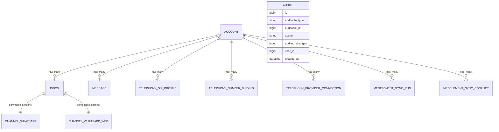

# OneLink — Полный контекст проекта, серверов и панели управления (Суперадминки)

---

## 1. Доступ к серверам и инфраструктура

> **Пользователь на всех серверах:** `root`.  
> **SSH-ключ на машине владельца (Windows):** `C:\Users\khamz\.ssh\id_ed25519`  
> *(Ключ никуда не копировать и не печатать).*

### 1.1 Серверы окружения
* **DEV (`5.189.148.163` / `dev.one-link.kz`)**:
  * **Назначение:** Разработка, тестирование, верификация гипотез.
  * **Активный сервис DEV:** `/srv/onelink-dev` (не трогать и не модифицировать без прямого разрешения владельца).
  * **Рабочие каталоги:** `/root/work/*-claude`.
  * **Текущая рабочая ветка задачи:** **`admin-dev`** в каталоге `/root/work/admin-claude` (базируется на dev-релизе коммита `93611c276e3b`).
  * **Окружение:**
    * Node.js 24: `export PATH=/opt/node-24/bin:$PATH`
    * Ruby 3.4.4: `/opt/rbenv/shims`
    * Bundler 2.5.16
  * **Тяжёлые прогоны (specs, build, linters):**
    `nice -n 10 flock /root/work/.claude-heavy.lock <команда>`

* **PROD (`173.249.51.242` / `app.one-link.kz`)**:
  * **Назначение:** Боевой продакшн OneLink.
  * **Контейнеры Docker:** `crafty-prod-*`
    * Rails: `crafty-prod-chatwoot_rails-1` и `crafty-prod-chatwoot_rails_2-1`
    * БД: `crafty-prod-postgres-1`
    * Nginx / Gateway: `crafty-prod-gateway-1`
  * **Репозиторий для push / gh:** `/root/crafty/onelink/chatwoot` *(сам каталог не изменять, работать исключительно через shared clone в `/tmp`)*.
  * **Конфиги деплоя:** `/root/crafty/deploy/**` *(не менять без явного «да» владельца)*.
  * **Режим работы:** **Строго Read-Only.** Любое изменение — только после явного «да» владельца на конкретное действие.

* **KZ (`188.241.217.162`)**:
  * **Назначение:** Телефония Wazo KZ + Janus Билайна.
  * **Каталог:** `/opt/onelink/janus-beeline-remote`
  * **Контейнеры:** `onelink-janus-beeline-caddy-1`, `onelink-janus-beeline-janus_beeline-1`.

---

### 1.2 SSH-подключение и выполнение команд (с Windows)

* **Стандартный вход:**
  ```powershell
  ssh -i C:\Users\khamz\.ssh\id_ed25519 -o BatchMode=yes root@<host>
  ```
* **Копирование файлов:**
  ```powershell
  scp -i C:\Users\khamz\.ssh\id_ed25519 <откуда> root@<host>:<куда>
  ```
* **Запуск скриптов без потери переменных и CRLF-ошибок (PowerShell):**
  ```powershell
  $script = (Get-Content -Raw "<путь_к_скрипту.sh>") -replace "\r`n", "`n"
  $script | ssh -i C:\Users\khamz\.ssh\id_ed25519 -o BatchMode=yes root@<host> "bash -s"
  ```
  *(Не подавать скрипт через интерактивный stdin ssh, не использовать `docker exec -i`).*

---

### 1.3 GitHub и релизная политика

* **Репозиторий:** `demomastra2025-eng/chatwoot`
* **Push только с PROD-хоста** через настроенный SSH-алиас:
  `git@github-demomastra2025-eng:demomastra2025-eng/chatwoot.git`
* **GitHub CLI (`gh`):** залогинен на PROD-хосте (версия старая: поддерживается только `gh api`).
* **Окружение production:** ID `21792421494`
  * Approve деплоя: `POST .../actions/runs/<id>/pending_deployments` с JSON через `--input`.
* **Ветка `onelink-dev`:** строго fast-forward, линейная история, без Pull Request.

---

### 1.4 Регламент безопасности и правила
1. **Прод — только чтение.** Все изменения только после прямого «да» владельца на каждое конкретное действие.
2. **Прод-БД — только read-only:**
   `PGOPTIONS='-c default_transaction_read_only=on'` — выводить только количества и агрегаты.
3. **Конфиденциальность данных:** Никогда не печатать в терминал и логи секреты, токены, пароли SIP, реальные телефоны и ИИН клиентов/пациентов.
4. **Внешние API (МедЭлемент):** DEV и PROD обращаются в боевой МедЭлемент (`api3.medelement.com`) — **никаких живых тестовых вызовов**.

---

## 2. Архитектура админки в проекте

В системе сосуществуют **два уровня** панелей управления:

1. **Суперадминка платформы (`/super_admin`)**:
   * **Движок бэкенда:** Rails **Administrate** (`SuperAdmin::ApplicationController < Administrate::ApplicationController`).
   * **Фронтенд:** Современный бандлер **Vite**, стили **Tailwind CSS**, компоненты **Vue 3**!
   * **Связка с Vue:** В `SuperAdmin::ApplicationController` реализован встроенный хелпер:
     ```ruby
     render_vue_component('ComponentName', props)
     ```
     Точка входа `app/javascript/entrypoints/superadmin_pages.js` находит контейнер `#app` и монтирует полноценное реактивное приложение Vue 3.
   * **Зона ответственности:** Мульти-тенантность (клиники/аккаунты), системный мониторинг, платформа, аудит, глобальные пользователи и настройки инстанса.

2. **Кабинет настроек клиники (`/app/accounts/:id/settings`)**:
   * **Движок:** Vue 3 SPA (`app/javascript/dashboard/routes/dashboard/settings/`) + Rails API v1.
   * **Зона ответственности:** Операторы, команды, каналы связи (Inboxes), интеграции, макросы, карточки пациентов.

---

## 3. Анализ исходного состояния (As-Is) и выявленные боли

До доработки суперадминка представляла собой стандартный табличный CRUD:

1. **Главная страница (`/super_admin`)**:
   * Шаблон `app/javascript/superadmin_pages/views/dashboard/Index.vue` содержал всего 67 строк кода.
   * Показывались только 4 сухих счётчика (`Accounts`, `Users`, `Inboxes`, `Conversations`) и график обращений за 30 дней.
   * **Боль:** Невозможно понять, работают ли клиники. Когда в клинике (например, Талгар или Intermedical) отваливался WhatsApp или телефония, инженеры узнавали об этом из системных логов или по звонку клиента.
2. **Список аккаунтов (`/super_admin/accounts`)**:
   * Показывались только `ID`, `Name`, `Locale`, `Users`, `Conversations`, `Status`.
   * Никаких данных о входящих линиях, провайдерах WhatsApp, номерах и привязке шлюзов.
3. **Мониторинг и логи (`/super_admin/monitoring`, `/super_admin/logs`)**:
   * Обычные `<iframe>`-вставки дашбордов Grafana без разбивки по клиентам.
4. **Журнал действий (Аудит)**:
   * Таблица `audits` (гем `audited`) велась в БД, но **UI для её просмотра в суперадминке отсутствовал полностью**.
5. **Биллинг-организации (`billing_organizations`)**:
   * В ветке `aset/dev` есть этот раздел, но в нашей кодовой базе этих моделей нет (паритет с `aset/dev` не требовался).

---

## 4. Реализованные доработки (To-Be) в ветке `admin-dev`

Все изменения зафиксированы на DEV-сервере в каталоге `/root/work/admin-claude` (ветка `admin-dev`):
**Коммит `1b64ff896`** (*feat(superadmin): add client health matrix, audit log viewer, and release bar*):

```
8 files changed, 581 insertions(+), 57 deletions(-)
create mode 100644 app/controllers/super_admin/audits_controller.rb
create mode 100644 app/services/super_admin/health_matrix_service.rb
create mode 100644 app/views/super_admin/audits/index.html.erb
```

### 4.1 Фича 1: Шапка, релиз-бар и навигация
* **Файл:** `app/views/super_admin/application/_navigation.html.erb`
* **Реализация:**
  * Добавлен фирменный блок OneLink Admin с бейджем окружения: пульсирующий зелёный индикатор **`DEV`**.
  * Отображается активный **Git SHA** коммита (из константы `GIT_HASH`, например `93611c27`).
  * Добавлен пункт меню **«Журнал аудита»** (`super_admin_audits_path`).
  * Главная страница переименована в **«Сводка здоровья»**.
  * Сайдбар оформлен на чистом Tailwind CSS.

### 4.2 Фича 2: «Матрица здоровья клиентов» (Health Matrix)
* **Сервис бэкенда:** `app/services/super_admin/health_matrix_service.rb`
* **Контроллер:** `app/controllers/super_admin/dashboard_controller.rb`
* **Шаблон:** `app/views/super_admin/dashboard/index.html.erb`
* **Vue 3 компонент:** `app/javascript/superadmin_pages/views/dashboard/Index.vue`
* **Что собирает сервис без живых вызовов внешних сервисов:**
  * **WhatsApp:** сканирует инбоксы клиники (`Channel::Whatsapp`, `Channel::WhatsappWeb`), проверяет валидность токена/сессии (`reauthorization_required?`).
  * **Телефония & Janus:** проверяет SIP-профили (`Telephony::SipProfile`), привязку номеров (`Telephony::NumberBinding`), статус `remote_janus_url` в подключениях провайдера (`Telephony::ProviderConnection`). Находит клиники с пустым Janus URL или линиями без привязки.
  * **МедЭлемент (МИС):** проверяет историю синхронизаций (`Integrations::Medelement::SyncRun`) и неразрешённые конфликты (`Integrations::Medelement::SyncConflict`).
  * **Зависшие сообщения:** считает сообщения в статусе `:failed` или застрявшие в очереди.
  * **Флаг `needs_attention`:** автоматически взводится в `true`, если хотя бы по одному направлению обнаружен сбой.
* **Интерфейс Vue 3:**
  * **4 KPI-карточки:** «Всего клиник», «⚠️ Требуют внимания» (красный акцент, кликабельная), «WhatsApp в норме», «Телефония OK».
  * **Кнопка «⚠️ Только с проблемами» (Needs Attention):** мгновенно скрывает здоровые клиники и оставляет только те, где упал WhatsApp, не задан Janus или зависли сообщения.
  * **Поиск:** фильтрация на лету по названию клиники или её ID.
  * **Таблица клиник:** цветовые индикаторы-пилюли (🟢/🟡/🔴), статус аккаунта, быстрый переход в настройки.
  * **Сворачиваемый график нагрузки:** график обращений за 30 дней убран под кнопку.

### 4.3 Фича 3: Журнал действий системы (`/super_admin/audits`)
* **Маршрут:** `config/routes.rb` (`resources :audits, only: [:index, :show]`).
* **Контроллер:** `app/controllers/super_admin/audits_controller.rb`.
* **Шаблон:** `app/views/super_admin/audits/index.html.erb`.
* **Возможности:**
  * Подключение существующей таблицы `audits` (гем `audited`).
  * Фильтрация по типу изменяемой модели (`Account`, `Channel`, `User`, `Inbox` и др.).
  * Фильтрация по действию: `create`, `update`, `destroy`.
  * Отображение: Дата/Время, Пользователь, Модель + ID, Действие (цветной бейдж), Детальный JSON diff изменённых полей (`audited_changes`) под спойлером.
  * Пагинация Kaminari (по 25 записей).

---

## 5. Схема моделей и связей данных



---

## 6. Карта файлов и изменений

```
/root/work/admin-claude/ (ветка admin-dev, коммит 1b64ff896)
├── app/
│   ├── controllers/
│   │   └── super_admin/
│   │       ├── dashboard_controller.rb     # Интеграция с HealthMatrixService
│   │       └── audits_controller.rb        # Контроллер журнала аудита
│   ├── services/
│   │   └── super_admin/
│   │       └── health_matrix_service.rb    # Сбор матрицы здоровья (RuboCop clean)
│   ├── views/
│   │   └── super_admin/
│   │       ├── application/
│   │       │   └── _navigation.html.erb    # Сайдбар с бейджем DEV, Git SHA и ссылкой на Audits
│   │       ├── dashboard/
│   │       │   └── index.html.erb          # Монтирование Vue 3 дашборда
│   │       └── audits/
│   │           └── index.html.erb          # Таблица аудита с фильтрами и diff
│   └── javascript/
│       └── superadmin_pages/
│           └── views/
│               └── dashboard/
│                   └── Index.vue           # Vue 3 интерфейс: светофоры, фильтр, KPI
└── config/
    └── routes.rb                           # Ресурс resources :audits в super_admin
```

---

## 7. Инструкция по проверке и дальнейшим действиям

### 7.1 Проверка на DEV-сервере
1. Подключиться по SSH к DEV:
   ```powershell
   ssh -i C:\Users\khamz\.ssh\id_ed25519 -o BatchMode=yes root@5.189.148.163
   ```
2. Перейти в рабочий каталог:
   ```bash
   cd /root/work/admin-claude
   git status
   git log -n 1 --stat
   ```
3. Проверка синтаксиса Ruby:
   ```bash
   export PATH=/opt/node-24/bin:/opt/rbenv/shims:$PATH
   ruby -c app/services/super_admin/health_matrix_service.rb
   ruby -c app/controllers/super_admin/dashboard_controller.rb
   ruby -c app/controllers/super_admin/audits_controller.rb
   ```

### 7.2 Порядок выкатки на сервис DEV (`/srv/onelink-dev`)
> Действующий сервис `/srv/onelink-dev` не изменяется автоматически. Выкатка производится только после согласования владельца:
> - Сборка ассетов (Vite): `nice -n 10 flock /root/work/.claude-heavy.lock bundle exec vite build`
> - Миграции базы (если есть): `bundle exec rails db:migrate`
> - Переключение релиза Capistrano / симлинка `current`.

### 7.3 Порядок выкатки на PROD (`173.249.51.242`)
1. Создать бандл или fast-forward коммит в `/root/crafty/onelink/chatwoot` через временный shared clone в `/tmp`.
2. Push в репозиторий через SSH-алиас: `git@github-demomastra2025-eng:demomastra2025-eng/chatwoot.git`.
3. Подтвердить deployment run в GitHub Actions через `gh api`.
