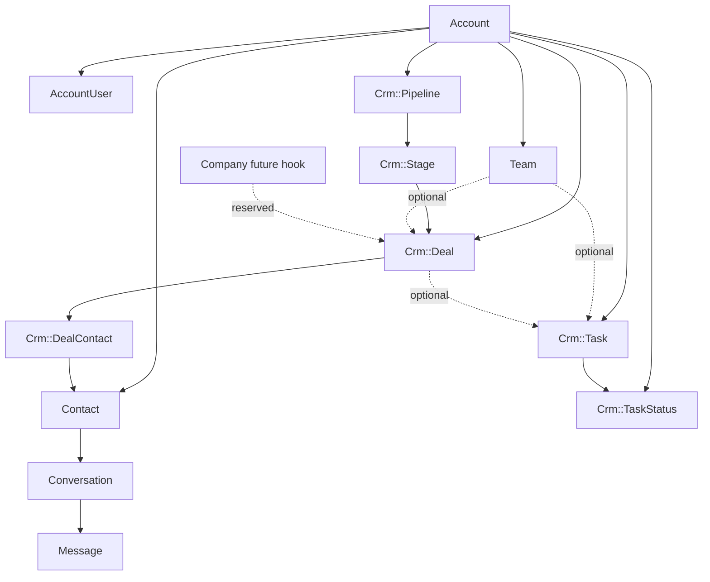
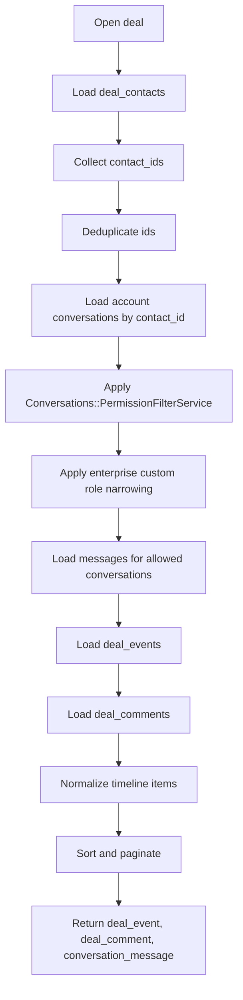
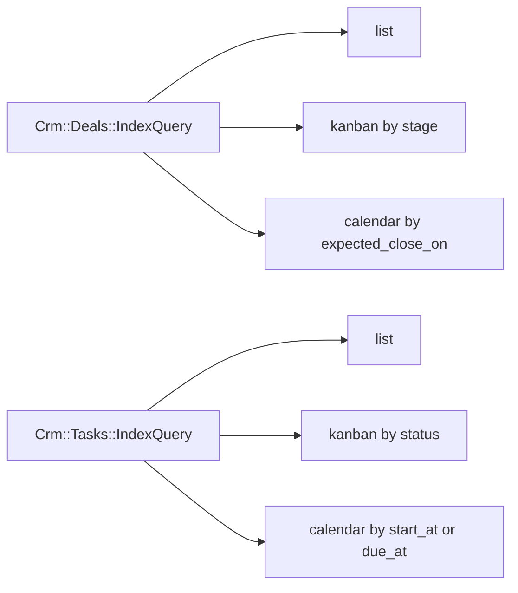
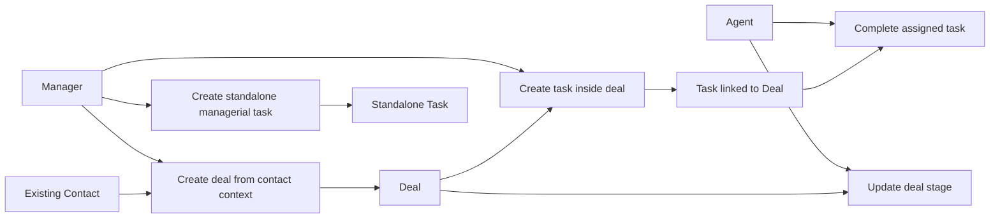
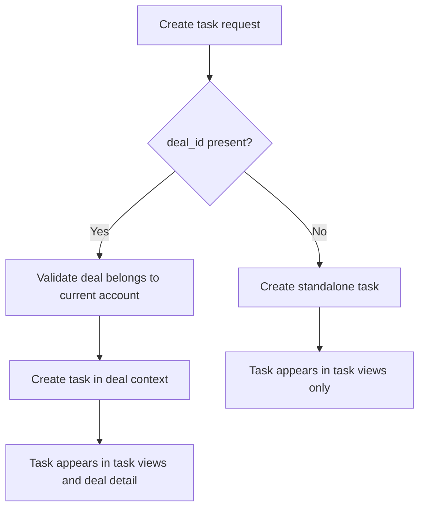
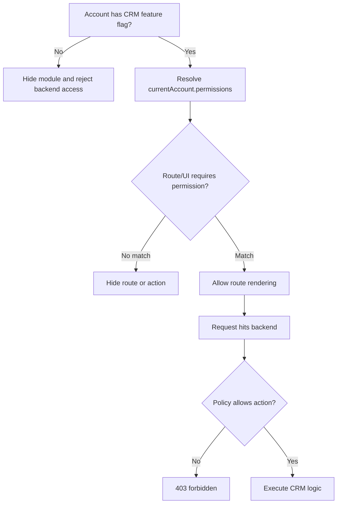
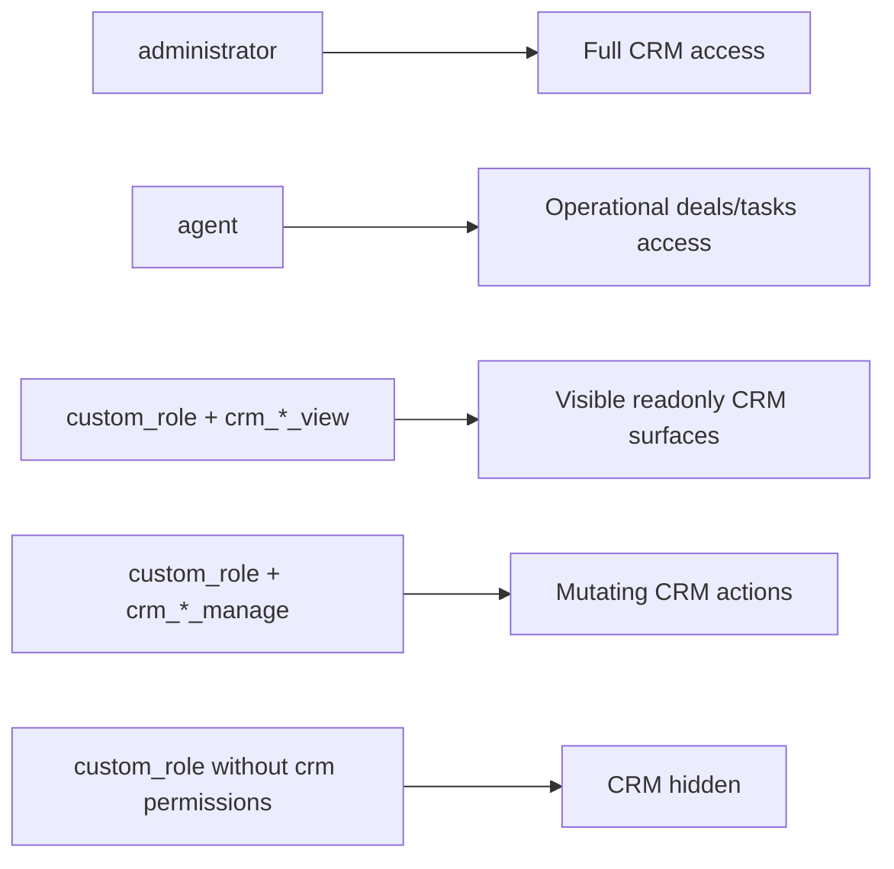

# CRM Backend Spec For Onelink

## Status

- Проверено по коду `onelink` на `2026-03-20`
- Этот документ описывает только backend
- Frontend, dashboard routes, stores и экраны обсуждаются отдельно следующим шагом
- Если документ расходится с кодом, источником истины считается код

## Что реально есть в коде сейчас

Ниже не намерения и не roadmap, а то, что уже подтверждено в репозитории:

- `Contact` уже является person-level сущностью и хранит `custom_attributes`, `additional_attributes`, связи с `Conversation`, `Note` и `Company`
- `Contact` уже поддерживает labels через общий `Labelable` concern
- `Conversation` уже является основной коммуникационной сущностью и привязана к `contact_id`
- `Message` и activity messages уже формируют timeline вокруг `Conversation`
- `Company` уже существует как account-scoped организация, но сейчас подключена через `enterprise/` overlay
- `Note` уже существует, но она строго contact-scoped и не подходит как комментарий к сделке или задаче
- `CustomAttributeDefinition` уже существует, но сейчас поддерживает только `contact_attribute` и `conversation_attribute`
- `Team` уже существует как account-scoped shared ownership primitive
- `Current.account` и `Current.account_user` уже являются основой account-scoped backend flow
- фильтрация доступа к переписке уже проходит через `Conversations::PermissionFilterService` и enterprise overlay для custom roles
- в проекте уже есть хороший образец нового native backend-модуля: `scheduling`

Проверенные кодовые опоры:

- `app/models/contact.rb`
- `app/models/conversation.rb`
- `app/models/note.rb`
- `app/models/custom_attribute_definition.rb`
- `app/models/team.rb`
- `enterprise/app/models/company.rb`
- `app/controllers/concerns/ensure_current_account_helper.rb`
- `app/services/conversations/permission_filter_service.rb`
- `enterprise/app/services/enterprise/conversations/permission_filter_service.rb`
- `app/controllers/api/v1/accounts/scheduling/base_controller.rb`
- `app/services/scheduling/payload_builder.rb`
- `app/services/scheduling/appointments/upsert_service.rb`

## Что в коде пока отсутствует

На момент проверки в коде нет first-class shared CRM runtime сущностей:

- `Deal`
- `Task`
- `Pipeline`
- `Stage`
- нормализованного CRM `Activity` слоя

Это значит, что CRM нужно строить как новый shared backend-модуль, а не как “включение уже существующего скрытого режима”.

## Ключевые архитектурные выводы

1. `Conversation` нельзя использовать как `Deal`

- переписка должна остаться в текущем communication core
- сделка должна быть отдельной бизнес-сущностью
- timeline сделки должен агрегировать данные из сделочных событий и существующих conversations/messages

2. `Contact` и `Company` должны переиспользоваться как нативные CRM-примитивы

- `Contact` остается person-level записью
- `Company` остается organization-level записью
- новую параллельную организационную модель создавать не нужно

3. `Note` нельзя переиспользовать как универсальный комментарий для CRM

- `Note` сейчас привязана к `contact`
- для `Deal` и `Task` нужны собственные комментарии

4. текущий `CustomAttributeDefinition` нельзя просто “распространить” на CRM v1

- сейчас enum и filter-layer завязаны только на `contact_attribute` и `conversation_attribute`
- безопаснее сделать отдельные definition tables для `Deal` и `Task`, а значения хранить в `jsonb custom_attributes`

5. contact labels и contact custom attributes уже являются нативным variability layer и должны переиспользоваться CRM

- не нужно дублировать contact labels в отдельных CRM-сущностях
- не нужно копировать contact custom attributes в `Deal` или `Task`
- сделки и задачи должны ссылаться на контакты, а не размножать их данные

6. новый CRM backend лучше строить по паттерну `scheduling`, а не по старому jbuilder CRUD стилю

- отдельный base controller
- единый `render_payload` / `render_error`
- payload builders
- request specs вместо опоры на старые controller specs

7. `Team` нужно использовать как нативный shared ownership layer там, где нужен групповой контекст

- у `Deal` можно иметь optional `team_id`
- у `Task` можно иметь optional `team_id`
- не нужно изобретать отдельную CRM-команду или department model

8. доступ к сообщениям внутри сделки должен идти через текущую permission-модель conversations

- просто “видит сделку” не означает “видит все сообщения всех связанных контактов”
- сообщение попадает в deal timeline только если пользователь имеет право видеть соответствующую conversation

## Non-goals для backend v1

В первую итерацию не делаем:

- новый чат-движок для сделок
- отдельный deal inbox transport layer
- автоматическое переприсваивание conversation ownership по deal ownership
- отдельный labels subsystem для `Deal` и `Task`
- сложную аналитику, автоворонки и automation rules поверх CRM
- глобальный полнотекстовый CRM search
- попытку сразу унифицировать весь старый `crm` integration layer

## Namespace и размещение кода

Целевой shared runtime namespace:

- `Crm::Pipeline`
- `Crm::Stage`
- `Crm::Deal`
- `Crm::Task`

Но в коде уже есть integration namespace вида `Crm::BaseProcessorService`, `Crm::LeadSquared::*`.

Поэтому перед реализацией нужно принять одно из двух решений:

1. Предпочтительный вариант:
- перенести существующие внешние CRM integrations из `Crm::*` в `Integrations::Crm::*`
- освободить `Crm::*` под shared runtime CRM

2. Временный вариант:
- оставить integration layer как есть
- новый shared CRM все равно положить в `Crm::*`, но строго разводить подпапки и константы

Для максимально нативной долгосрочной архитектуры предпочтителен первый вариант.

Размещение новых файлов:

- модели: `app/models/crm/`
- сервисы: `app/services/crm/`
- контроллеры: `app/controllers/api/v1/accounts/crm/`
- политики: `app/policies/`
- request specs: `spec/requests/api/v1/accounts/crm/`
- model specs: `spec/models/crm/`
- service specs: `spec/services/crm/`
- policy specs: `spec/policies/`

Новый shared CRM код должен жить в `app/`, не в `enterprise/`.

## Предлагаемая доменная модель

### Pipelines

`Crm::Pipeline`

- `account_id`
- `name`
- `code`
- `category`
- `active`
- `default`

`Crm::Stage`

- `pipeline_id`
- `name`
- `code`
- `position`
- `outcome`
- `active`

`outcome` должен быть enum:

- `open`
- `won`
- `lost`

Почему так:

- это надежнее, чем набор флагов `is_final/is_won/is_lost`
- состояние сделки выводится из stage outcome
- меньше риска логических противоречий

### Deals

`Crm::Deal`

- `account_id`
- `pipeline_id`
- `stage_id`
- `owner_id`
- `team_id`
- `company_id`
- `originating_conversation_id`
- `title`
- `description`
- `lead_source_code`
- `amount_minor`
- `currency`
- `expected_close_on`
- `win_probability`
- `custom_attributes`
- timestamps

`Crm::DealContact`

- `deal_id`
- `contact_id`
- `primary`

`Crm::DealEvent`

- `deal_id`
- `account_id`
- `actor_id`
- `event_type`
- `meta`
- timestamps

`Crm::DealComment`

- `deal_id`
- `account_id`
- `user_id`
- `body`
- timestamps

`company_id` в `Crm::Deal` на старте рассматривается как резерв под будущую связку.

Для v1:

- компания может присутствовать в схеме как nullable поле
- backend не строит на ней бизнес-логику
- company не участвует в timeline aggregation
- company не определяет permissions, filters и workflow
- семантика связи будет определена отдельно, когда появится понимание реального кейса

Поэтому в v1 не нужен `DealCompany` join table и не нужна company-based оркестрация.

### Tasks

`Crm::Task`

- `account_id`
- `creator_id`
- `deal_id`
- `team_id`
- `title`
- `description`
- `status_id`
- `start_at`
- `due_at`
- `completed_at`
- `parent_task_id`
- `custom_attributes`
- timestamps

`Task` является самостоятельной сущностью.

Это значит:

- задача может существовать вообще без связи с `Deal`
- задача может быть связана со сделкой
- lifecycle задачи не зависит от lifecycle сделки
- задача не является subtype сделки

`Crm::TaskStatus`

- `account_id`
- `name`
- `code`
- `position`
- `category`
- `default`
- `active`

`category` должен быть enum:

- `open`
- `done`
- `archived`

Это лучше, чем три boolean флага:

- нельзя получить одновременно `done = true` и `archived = true`
- проще строить scopes и фильтры
- проще строить kanban и counters позже

`Crm::TaskAssignee`

- `task_id`
- `user_id`

`Crm::TaskComment`

- `task_id`
- `account_id`
- `user_id`
- `body`

`Crm::TaskEvent`

- `task_id`
- `account_id`
- `actor_id`
- `event_type`
- `meta`

Для v1 задача может быть:

- standalone
- optional связана с `Crm::Deal`

Для максимально нативного v1 прямой `deal_id` надежнее, чем универсальная relation table.

Если позже реально понадобятся связи на:

- `Contact`
- `Company`
- `Conversation`
- другие будущие CRM сущности

тогда можно будет добавить relation layer как расширение, не ломая базовую модель.

### Mermaid: Shared CRM entity graph



## Custom fields

Для v1 рекомендуется такой подход:

- `Crm::DealFieldDefinition`
- `Crm::TaskFieldDefinition`
- `custom_attributes` на `Crm::Deal` и `Crm::Task` как `jsonb`

`FieldDefinition` должен хранить:

- `account_id`
- `key`
- `label`
- `field_type`
- `required`
- `position`
- `options`
- `active`
- `description`

Поддерживаемые типы полей:

- `text`
- `textarea`
- `number`
- `currency`
- `checkbox`
- `date`
- `datetime`
- `select`
- `multiselect`
- `url`

Валидация должна происходить в сервисе записи сущности, а не только на frontend.

Почему не value-table в v1:

- `jsonb` проще и нативнее для текущего кода
- это уже используемый паттерн в репозитории
- definition layer дает схему и валидацию без избыточной EAV-сложности

## Reuse текущих contact labels и contact attributes

CRM v1 должен использовать уже существующие возможности `Contact` как shared customer entity:

- `Contact.label_list`
- `Contact.custom_attributes`
- `Contact.additional_attributes`
- текущую связь `Contact -> Conversation`

Практическое правило:

- `Deal` и `Task` не дублируют labels контакта
- `Deal` и `Task` не копируют contact custom attributes в свои таблицы
- если нужно отобразить сегментацию клиента, CRM берет ее из `Contact`

Это дает несколько полезных свойств:

- один источник истины по person-level данным
- reuse существующего label engine проекта
- reuse существующего custom attribute engine проекта
- меньше риска рассинхронизации между CRM и communication core

Следствие для backend:

- deal list/detail payload может включать summary по связанным контактам
- в contact summary допустимо отдавать `labels`, `custom_attributes`, `additional_attributes` по необходимости
- фильтры сделок можно позже расширять через contact labels и contact custom attributes, не изобретая для этого отдельный CRM metadata layer

## Что не нужно вводить в v1

Для `Deal` и `Task` в первой версии не нужен отдельный labels subsystem.

Причины:

- в проекте labels уже нативно завязаны на `Contact` и `Conversation`
- rename/update сервисы labels сейчас работают только с этими сущностями
- для сделки primary workflow state уже покрывается `Pipeline/Stage`
- для задачи primary workflow state уже покрывается `TaskStatus`

Если позже реально понадобятся labels на `Deal` или `Task`, это лучше делать отдельной фазой с расширением label infrastructure, а не полумерой в v1.

## Deal timeline

### Принцип

Карточка сделки не хранит отдельные “deal conversations”.

Она агрегирует:

- `deal_events`
- `deal_comments`
- все разрешенные `messages` из conversations связанных контактов

### Источники контактов для timeline

1. прямые `deal_contacts`

После этого:

1. объединяем contact ids
2. убираем дубликаты
3. загружаем `Current.account.conversations.where(contact_id: ids)`
4. пропускаем relation через `Conversations::PermissionFilterService`
5. добавляем enterprise narrowing для custom roles автоматически через overlay
6. только после этого загружаем сообщения

### Важное правило доступа

Пользователь может видеть сделку, но не видеть часть conversation history внутри нее.

Следовательно:

- deal timeline показывает только те conversations/messages, которые разрешены текущей permission-моделью
- backend не должен обходить эту проверку “ради удобства CRM”
- `company_id` в v1 не расширяет timeline и не добавляет новые conversations

### Реализация timeline

Для backend v1 нужен отдельный query object:

- `Crm::Deals::TimelineQuery`

Он должен:

- принимать `deal`, `current_user`, `current_account`, `cursor`, `limit`
- возвращать нормализованные timeline items
- поддерживать pagination
- не тянуть все сообщения по сделке одним запросом без лимита

Нормализованные типы timeline item:

- `deal_event`
- `deal_comment`
- `conversation_message`

### Mermaid: Deal timeline logic



## View semantics для backend

И `Deal`, и `Task` должны поддерживать несколько представлений, но backend не должен моделировать это отдельными сущностями.

### Deals

Поддерживаемые view modes:

- `list`
- `kanban`
- `calendar`

Семантика:

- `list` это обычный index с filters/sort/pagination
- `kanban` это группировка по `stage`
- `calendar` это выборка по `expected_close_on`

### Tasks

Поддерживаемые view modes:

- `list`
- `kanban`
- `calendar`

Семантика:

- `list` это обычный index с filters/sort/pagination
- `kanban` это группировка по `status`
- `calendar` это выборка по `start_at` и/или `due_at`

### Практическое требование к API

Backend должен поддерживать один и тот же domain model для разных view.

Значит нужны query services, а не разные сущности:

- `Crm::Deals::IndexQuery`
- `Crm::Tasks::IndexQuery`

Они должны уметь:

- фильтрацию
- сортировку
- range queries для календаря
- grouped response для kanban
- pagination для list
- фильтрацию по owner/team/contact/deal status/task status

### Mermaid: View/query logic



## Mermaid use cases

### Mermaid: Primary backend cases



### Mermaid: Task cases logic



## События и аудит

### Deal events

Логируем:

- создание сделки
- смену owner
- смену pipeline
- смену stage
- изменение суммы
- изменение currency
- изменение lead source
- привязку контакта
- отвязку контакта
- изменение custom fields

### Task events

Логируем:

- создание задачи
- смену статуса
- назначение исполнителей
- снятие исполнителей
- изменение сроков
- создание подзадачи
- удаление подзадачи

Комментарии не должны жить внутри event table как единственный источник текста.

Надежнее хранить:

- комментарии отдельно
- аудит отдельно

## API surface

Новые backend endpoints нужно строить как account-scoped namespace:

```text
/api/v1/accounts/:account_id/crm/...
```

Рекомендуемый набор:

- `pipelines#index/create/show/update/destroy`
- `pipelines/:pipeline_id/stages#create/update/destroy`
- `deals#index/create/show/update`
- `deals/:id/transition`
- `deals/:deal_id/contacts#create/destroy`
- `deals/:deal_id/comments#index/create/update/destroy`
- `deals/:deal_id/timeline#index`
- `deal_field_definitions#index/create/update/destroy`
- `tasks#index/create/show/update`
- `tasks/:task_id/comments#index/create/update/destroy`
- `task_statuses#index/create/update/destroy`
- `task_field_definitions#index/create/update/destroy`

Для `index` endpoints нужно сразу предусмотреть query-параметры под будущие view:

- `view`
- `page`
- `sort_by`
- `order`
- `from`
- `to`
- `owner_id`
- `team_id`
- `pipeline_id`
- `stage_id`
- `status_id`
- `deal_id`
- `contact_id`
- `labels`

Для нового CRM API лучше использовать отдельный base controller по образцу scheduling:

- `Api::V1::Accounts::Crm::BaseController`

В нем должны быть:

- feature gating
- общий error envelope
- `render_payload`
- `render_error`
- `parse_boolean`
- cursor parsing helpers

## API contract conventions

CRM API должен reuse уже существующий паттерн новых модулей проекта:

- успешный ответ через `render_payload`
- ошибка через `render_error`
- основной объект всегда живет под ключом `payload`
- служебные данные pagination, cursors, counts, view mode живут под `meta`

### Success envelope

Рекомендуемый success shape:

```json
{
  "payload": {},
  "meta": {}
}
```

`meta` опционален и добавляется только когда реально нужен.

### Error envelope

Рекомендуемый error shape:

```json
{
  "error": "stage must belong to pipeline",
  "code": "STAGE_PIPELINE_MISMATCH",
  "details": {
    "stage_id": [
      "must belong to pipeline"
    ]
  }
}
```

Важно:

- не возвращать ad-hoc ошибки без `code`
- не отдавать сырой stack trace
- `details` использовать для field-level validation и конфликтов ссылок

### Recommended payload shapes

Для detail endpoints:

```json
{
  "payload": {
    "deal": {
      "id": 101,
      "account_id": 1,
      "title": "Enterprise renewal",
      "pipeline_id": 10,
      "stage_id": 14,
      "owner_id": 7,
      "team_id": null,
      "company_id": null,
      "amount_minor": 2500000,
      "currency": "KZT",
      "expected_close_on": "2026-04-30",
      "win_probability": 65,
      "custom_attributes": {},
      "created_at": "2026-03-20T10:00:00Z",
      "updated_at": "2026-03-20T10:00:00Z"
    },
    "contacts": [
      {
        "id": 55,
        "name": "Aruzhan Nurpeisova",
        "label_list": [
          "vip",
          "renewal"
        ],
        "custom_attributes": {}
      }
    ],
    "pipeline": {
      "id": 10,
      "name": "Sales"
    },
    "stage": {
      "id": 14,
      "name": "Negotiation",
      "outcome": "open"
    }
  }
}
```

Для list view:

```json
{
  "payload": {
    "items": []
  },
  "meta": {
    "view": "list",
    "page": 1,
    "per_page": 25,
    "total_count": 120
  }
}
```

Для kanban view:

```json
{
  "payload": {
    "groups": [
      {
        "key": "negotiation",
        "label": "Negotiation",
        "count": 8,
        "items": []
      }
    ]
  },
  "meta": {
    "view": "kanban"
  }
}
```

Для calendar view:

```json
{
  "payload": {
    "range": {
      "from": "2026-04-01",
      "to": "2026-04-30"
    },
    "items": []
  },
  "meta": {
    "view": "calendar"
  }
}
```

Практическое правило:

- одна и та же сделка или задача должна иметь один canonical payload shape
- list, kanban и calendar отличаются aggregation/meta, а не разными сериализациями одной сущности

## Validation rules и error codes

Все mutating endpoints должны работать через сервисы и транзакции.

### Deal create/update validation

- `title` обязателен
- `pipeline_id` обязателен
- `stage_id` обязателен и должен принадлежать указанному pipeline
- `owner_id` обязателен и должен принадлежать текущему account
- `team_id` optional, но если передан, должен принадлежать текущему account
- `company_id` optional, но если передан, должен принадлежать текущему account
- `amount_minor` не может быть отрицательным
- если задан `amount_minor`, должна быть задана `currency`
- `currency` должна быть трехбуквенным ISO code
- `win_probability` только в диапазоне `0..100`
- `contact_ids` на create должны быть непустыми
- `contact_ids` должны быть уникальны и принадлежать текущему account

### Task create/update validation

- `title` обязателен
- `status_id` обязателен и должен принадлежать текущему account
- `creator_id` не принимается снаружи, а заполняется из `Current.user`
- `deal_id` optional, но если передан, должен принадлежать текущему account
- `team_id` optional, но если передан, должен принадлежать текущему account
- `due_at` не может быть раньше `start_at`
- assignee ids должны быть уникальны и принадлежать текущему account
- `parent_task_id` optional, но если передан, должен принадлежать текущему account и не создавать циклов

### Pipeline, stage и task status validation

- `code` уникален в своем scope
- должен существовать один default pipeline на account, если CRM deals включен
- должен существовать один default open task status на account, если CRM tasks включен
- stage нельзя привязать к чужому pipeline
- referenced stage/status нельзя удалить без миграции связанных records
- task status configuration в v1 считается частью CRM workflow settings и управляется тем же permission layer, что и pipeline settings

### Recommended error codes

- `FEATURE_DISABLED`
- `FORBIDDEN`
- `DEAL_NOT_FOUND`
- `TASK_NOT_FOUND`
- `PIPELINE_NOT_FOUND`
- `STAGE_NOT_FOUND`
- `TASK_STATUS_NOT_FOUND`
- `CONTACT_NOT_FOUND`
- `COMPANY_NOT_FOUND`
- `VALIDATION_ERROR`
- `STAGE_PIPELINE_MISMATCH`
- `CROSS_ACCOUNT_REFERENCE`
- `DUPLICATE_CODE`
- `CANNOT_DELETE_REFERENCED_RECORD`
- `INVALID_DATE_RANGE`
- `INVALID_CURSOR`

### Error mapping

- `403`
  - `FEATURE_DISABLED`
  - `FORBIDDEN`
- `404`
  - resource-specific `*_NOT_FOUND`
- `409`
  - `DUPLICATE_CODE`
- `422`
  - `VALIDATION_ERROR`
  - `STAGE_PIPELINE_MISMATCH`
  - `CROSS_ACCOUNT_REFERENCE`
  - `CANNOT_DELETE_REFERENCED_RECORD`
  - `INVALID_DATE_RANGE`
  - `INVALID_CURSOR`

## Сервисы

### Pipelines

- `Crm::Pipelines::UpsertService`
- `Crm::Pipelines::DeleteService`
- `Crm::Stages::UpsertService`
- `Crm::Stages::DeleteService`

### Deals

- `Crm::Deals::UpsertService`
- `Crm::Deals::TransitionService`
- `Crm::Deals::LinkContactsService`
- `Crm::Deals::CommentService`
- `Crm::Deals::TimelineQuery`
- `Crm::Deals::IndexQuery`
- `Crm::Deals::EventRecorder`

### Tasks

- `Crm::Tasks::UpsertService`
- `Crm::Tasks::AssignService`
- `Crm::Tasks::ChangeStatusService`
- `Crm::Tasks::CommentService`
- `Crm::Tasks::IndexQuery`
- `Crm::Tasks::EventRecorder`

Оркестрация должна жить в сервисах, а не в моделях и не в контроллерах.

## Lifecycle, archive и delete semantics

Для надежного v1 публичные destructive операции нужно минимизировать.

### Deals

- `Deal` не должен иметь public hard delete в v1
- вместо этого используется archive semantics
- архивные сделки исключаются из default list/kanban/calendar
- для включения архивных сделок нужен явный filter, например `include_archived=true`
- архивирование не удаляет `deal_events`, `deal_comments` и `deal_contacts`

### Tasks

- `Task` не должен иметь public hard delete в v1
- completed и archived задачи это разные состояния
- `completed` означает завершенную работу
- `archived` означает скрытие из operational surfaces
- standalone task и task внутри сделки используют один lifecycle

### Pipelines, stages и task statuses

- если сущность уже используется, вместо hard delete применяется `active = false`
- hard delete допустим только для нереференсных записей
- default pipeline и default task status нельзя деактивировать без замены

### Comments

- комментарии не должны каскадно удалять parent entity
- удаление комментария должно писать audit event
- если нужна совместимость с compliance/history, предпочтителен soft delete через `deleted_at`

## Domain events и hooks

CRM должен иметь внутренний domain event layer, но не должен в первой версии тащить синхронные внешние интеграции в request path.

### After-commit events

Рекомендуемые внутренние события:

- `crm.deal.created`
- `crm.deal.updated`
- `crm.deal.stage_changed`
- `crm.deal.archived`
- `crm.deal.contacts_changed`
- `crm.task.created`
- `crm.task.updated`
- `crm.task.status_changed`
- `crm.task.assignees_changed`
- `crm.task.archived`

### Правила публикации событий

- событие публикуется только после успешного commit
- payload события должен содержать ids и snapshot полей, а не тяжелые ActiveRecord объекты
- событие не должно ломать основной request, если downstream listener временно недоступен
- request path не должен синхронно ждать внешние CRM/webhook adapters

### Интеграция с существующим проектом

- CRM internal events можно потом связать с `Integrations::Hook` или отдельным webhook layer
- в v1 это не должно быть обязательным условием для CRUD операций
- если webhook/export появится позже, он должен подписываться на domain events, а не внедряться в модели через прямые callbacks

## Политики и доступ

### Базовое правило для v1

Нельзя автоматически выводить CRM permissions из conversation permissions.

Это разные домены:

- переписка отвечает за communication visibility
- CRM отвечает за business entity visibility

### Практичный v1

Для первой итерации:

- `administrator` получает полный CRUD
- `agent` получает чтение и изменение deals/tasks внутри account
- изменение pipeline/stage/task status configuration доступно только administrator

Отдельно:

- вложенные conversations/messages внутри deal timeline дополнительно режутся существующей conversation permission-моделью

### Custom roles

Текущая custom role модель знает:

- `conversation_manage`
- `conversation_unassigned_manage`
- `conversation_participating_manage`
- `contact_manage`
- `report_manage`
- `knowledge_base_manage`

В v1 CRM не должен гадать, что `contact_manage == deal_manage`.

Поэтому есть два безопасных пути:

1. На старте не привязывать CRM к custom role permissions и жить на `administrator/agent`
2. Добавить новые permissions отдельно:
   - `crm_deal_view`
   - `crm_deal_manage`
   - `crm_task_view`
   - `crm_task_manage`
   - `crm_pipeline_view`
   - `crm_pipeline_manage`

Для надежности лучше выбрать один из этих путей явно и зафиксировать до начала frontend.

Для гармоничной интеграции с текущим проектом нужен второй вариант.

Причина:

- в проекте уже есть нативная permission-модель на `AccountUser.permissions`
- custom roles уже отдаются во frontend
- dashboard routes уже умеют скрываться по `meta.permissions`
- значит CRM лучше встроить в эту же модель, а не вводить отдельную capability-систему с нуля

## Role, permission и interface gating

### Базовый принцип

Для CRM должны работать три уровня включения:

1. `feature flag`
2. `permission`
3. `policy`

Это дает неразрушающую схему:

- feature flag включает или выключает CRM для account целиком
- permission определяет, какие модули, экраны и действия видит пользователь
- policy окончательно проверяет доступ на backend

### Что уже есть в проекте и что нужно reuse

В текущем проекте уже существует подход:

- `AccountUser#permissions`
- `resource.account_users[].permissions` в user payload
- `currentAccount.permissions` на frontend
- `route.meta.permissions`
- `hasPermissions()` / `routeIsAccessibleFor()` в dashboard helper layer

Следовательно, CRM должен reuse именно этот механизм.

Нельзя вводить отдельную параллельную логику вида:

- `crm_capabilities_v2`
- отдельный специальный auth store только для CRM
- frontend-only флаги без backend permission source

### Recommended CRM permissions

Для shared CRM v1 лучше ввести явные permissions:

- `crm_deal_view`
- `crm_deal_manage`
- `crm_task_view`
- `crm_task_manage`
- `crm_pipeline_view`
- `crm_pipeline_manage`

Семантика:

- `*_view` дает доступ к маршрутам, спискам, detail screen, timeline, календарю и kanban
- `*_manage` дает мутации: create, update, transition, comment create, assign, status change

### Safe default behavior

Чтобы не ломать текущий проект, поведение должно быть таким:

- `administrator` сохраняет полный доступ
- обычный `agent` сохраняет operational CRM access
- `custom_role` получает доступ к CRM только при наличии явных `crm_*` permissions

Это важно, потому что текущий frontend helper использует OR-семантику по `permissions`, а custom role пользователь не наследует строку `'agent'`.

Значит CRM routes и UI actions должны описываться так, чтобы:

- admin и agent продолжали работать без миграции текущих аккаунтов
- custom roles получали CRM только по явному разрешению

### Permission matrix

Рекомендуемая матрица:

- `administrator`
  - полный доступ к deals, tasks, pipelines
- `agent`
  - view/manage deals
  - view/manage tasks
  - без pipeline/stage configuration
- `custom_role` + `crm_deal_view`
  - видит deals module и deal detail
- `custom_role` + `crm_deal_manage`
  - может изменять сделки, stage, owner, comments
- `custom_role` + `crm_task_view`
  - видит tasks module и task detail
- `custom_role` + `crm_task_manage`
  - может создавать и изменять задачи
- `custom_role` + `crm_pipeline_view`
  - видит pipeline configuration screens
- `custom_role` + `crm_pipeline_manage`
  - может изменять pipeline/stage settings

### Backend policy rules

Политики должны быть совместимы с текущей моделью ролей:

- `administrator` всегда проходит
- `agent` проходит для operational CRM actions
- `custom_role` проходит только при наличии соответствующего `crm_*` permission

Разделение по сущностям:

- `DealPolicy#index/show`
  - `administrator`
  - `agent`
  - `custom_role` с `crm_deal_view` или `crm_deal_manage`
- `DealPolicy#create/update/transition/comment`
  - `administrator`
  - `agent`
  - `custom_role` с `crm_deal_manage`
- `TaskPolicy#index/show`
  - `administrator`
  - `agent`
  - `custom_role` с `crm_task_view` или `crm_task_manage`
- `TaskPolicy#create/update/assign/change_status/comment`
  - `administrator`
  - `agent`
  - `custom_role` с `crm_task_manage`
- `PipelinePolicy#index/show`
  - `administrator`
  - `agent` только если нужен operational read
  - `custom_role` с `crm_pipeline_view` или `crm_pipeline_manage`
- `PipelinePolicy#create/update/destroy`
  - `administrator`
  - `custom_role` с `crm_pipeline_manage`

### Action-level policy matrix

Ниже должна быть зафиксирована action-level семантика, чтобы backend и frontend интерпретировали права одинаково:

| Action | administrator | agent | custom role |
| --- | --- | --- | --- |
| `deals#index` | yes | yes | `crm_deal_view` or `crm_deal_manage` |
| `deals#show` | yes | yes | `crm_deal_view` or `crm_deal_manage` |
| `deals#create` | yes | yes | `crm_deal_manage` |
| `deals#update` | yes | yes | `crm_deal_manage` |
| `deals#transition` | yes | yes | `crm_deal_manage` |
| `deals/contacts#create` | yes | yes | `crm_deal_manage` |
| `deals/contacts#destroy` | yes | yes | `crm_deal_manage` |
| `deals/comments#index` | yes | yes | `crm_deal_view` or `crm_deal_manage` |
| `deals/comments#create` | yes | yes | `crm_deal_manage` |
| `deals/comments#update` | yes | yes | `crm_deal_manage` |
| `deals/comments#destroy` | yes | yes | `crm_deal_manage` |
| `deals/timeline#index` | yes | yes | `crm_deal_view` or `crm_deal_manage` |
| `tasks#index` | yes | yes | `crm_task_view` or `crm_task_manage` |
| `tasks#show` | yes | yes | `crm_task_view` or `crm_task_manage` |
| `tasks#create` | yes | yes | `crm_task_manage` |
| `tasks#update` | yes | yes | `crm_task_manage` |
| `tasks#change_status` | yes | yes | `crm_task_manage` |
| `tasks#assign` | yes | yes | `crm_task_manage` |
| `tasks/comments#index` | yes | yes | `crm_task_view` or `crm_task_manage` |
| `tasks/comments#create` | yes | yes | `crm_task_manage` |
| `tasks/comments#update` | yes | yes | `crm_task_manage` |
| `tasks/comments#destroy` | yes | yes | `crm_task_manage` |
| `pipelines#index` | yes | optional read | `crm_pipeline_view` or `crm_pipeline_manage` |
| `pipelines#create` | yes | no | `crm_pipeline_manage` |
| `pipelines#update` | yes | no | `crm_pipeline_manage` |
| `pipelines#destroy` | yes | no | `crm_pipeline_manage` |
| `stages#create` | yes | no | `crm_pipeline_manage` |
| `stages#update` | yes | no | `crm_pipeline_manage` |
| `stages#destroy` | yes | no | `crm_pipeline_manage` |
| `task_statuses#index` | yes | optional read | `crm_pipeline_view` or `crm_pipeline_manage` |
| `task_statuses#create` | yes | no | `crm_pipeline_manage` |
| `task_statuses#update` | yes | no | `crm_pipeline_manage` |
| `task_statuses#destroy` | yes | no | `crm_pipeline_manage` |

### Frontend route and interface gating

Чтобы это было гармонично с текущим dashboard, CRM frontend должен reuse существующий route permission pattern:

- route-level visibility через `meta.permissions`
- sidebar visibility через те же permission arrays
- page actions и buttons через `currentAccount.permissions`

Примеры route meta для будущих CRM экранов:

- deals list/detail:
  - `['administrator', 'agent', 'crm_deal_view', 'crm_deal_manage']`
- tasks list/detail:
  - `['administrator', 'agent', 'crm_task_view', 'crm_task_manage']`
- pipeline settings:
  - `['administrator', 'crm_pipeline_view', 'crm_pipeline_manage']`

Почему так:

- `administrator` и `agent` продолжают работать как раньше
- `custom_role` пользователь попадет на route только если в `currentAccount.permissions` есть нужный `crm_*`
- это полностью совпадает с уже существующим `routeIsAccessibleFor()`

### Interface gating beyond routes

Одних route permissions недостаточно.

Нужно отдельно скрывать:

- sidebar items
- page tabs
- create buttons
- edit forms
- transition actions
- assign actions
- pipeline settings actions

Правило:

- `view` permission открывает модуль и readonly surfaces
- `manage` permission открывает mutating actions

### Почему это не ломает текущий проект

Потому что схема additive:

- новые `crm_*` permissions просто добавляются в custom role permission list
- существующие users без custom role продолжают жить на `administrator/agent`
- текущий permission helper, route helper и user payload не требуют замены
- backend policies просто добавляют новый домен, не меняя действующую conversation/contact access модель

### Mermaid: feature/permission/policy flow



### Mermaid: role access cases



## Feature flags и rollout

Новый backend нужно включать по account-level feature flags, а не скрывать только через frontend.

Рекомендуемые флаги:

- `crm_deals`
- `crm_tasks`
- `crm_pipelines`

Правила rollout:

- миграции только additive
- nullable внешние ключи на старте
- дефолтные pipelines и task statuses можно seed'ить только при явном включении функции
- mixed-state accounts должны поддерживаться во время rollout
- нельзя переиспользовать существующие `crm`, `crm_v2`, `crm_integration` флаги как runtime-флаги нового shared CRM

## Compatibility contract для текущего проекта

Новый CRM backend должен внедряться как строго additive слой.

Это значит:

- не меняются текущие semantics у `Contact`, `Conversation`, `Message`, `Note`, `Company`
- не меняются существующие contact/conversation routes и payload contracts
- не переиспользуется `crm_v2` как флаг нового deals/tasks runtime
- не добавляются обязательные CRM callbacks в текущие communication core сущности
- не добавляется скрытая бизнес-логика CRM в existing contact update flows
- не меняется текущая permission-модель conversations, contacts и reports
- не ломается enterprise overlay и текущий custom role flow

### Что считается безопасной интеграцией

Безопасным для текущего проекта считается такой rollout:

- новые таблицы и индексы создаются отдельно
- новые routes живут только под `/api/v1/accounts/:account_id/crm/...`
- новые permissions добавляются только как additive entries в existing permission list
- новые feature flags включаются явно по account и по умолчанию выключены
- новые sidebar items, routes и actions появляются только при совпадении feature flag и permission
- существующие accounts без CRM feature flags не получают изменений в поведении
- существующие API consumers не обязаны обрабатывать новые CRM payloads

### Что нельзя делать при реализации

Чтобы не ломать текущий проект, нельзя:

- превращать `Conversation` в источник истины для сделки
- менять текущие contact filters ради CRM semantics
- расширять `Note` до deal/task note через side effects в existing model
- внедрять required foreign keys из старых сущностей в новые CRM таблицы на старте
- добавлять cross-domain callbacks вида `after_save Contact => mutate deals/tasks`
- автосоздавать CRM данные для всех account'ов без явного feature rollout
- делать frontend-only gating без backend policy и feature checks

### Что можно добавлять без риска

Можно безопасно добавлять:

- новые CRM модели в `app/models/crm/`
- новые account-scoped services в `app/services/crm/`
- новые API endpoints в `api/v1/accounts/crm`
- новые payload builders для CRM responses
- новые policy classes для CRM домена
- новые request specs и service specs без переписывания старых flow

### Принцип расширяемости

Если позже появятся:

- полноценная company linkage logic
- CRM labels для deals/tasks
- relation layer beyond `task.deal_id`
- automation и reminders
- reporting и forecasting

это должно добавляться как новые слои поверх v1, а не через переписывание уже существующих contact/conversation primitives.

## Миграции и ограничения данных

Обязательные ограничения:

- все CRM сущности account-scoped
- все cross-links должны валидироваться на принадлежность одному `account_id`
- `stage.pipeline_id` должен совпадать с `deal.pipeline_id`
- `owner_id`, `creator_id`, assignees должны принадлежать текущему account
- `team_id` должен принадлежать текущему account
- `deal_id` у задачи должен принадлежать текущему account
- `currency` хранить как трехбуквенный код
- деньги хранить в minor units, не в `decimal`
- `win_probability` ограничить диапазоном `0..100`
- уникальные индексы для `code` в рамках account или pipeline

Отдельно:

- `TaskStatus` должен быть account-scoped, а не “у каждой компании свой набор статусов”
- `Company` в v1 CRM не является источником workflow-логики

## Порядок реализации backend

### Phase 0. Foundation

- принять решение по namespace `Crm`
- добавить feature flags
- добавить `Api::V1::Accounts::Crm::BaseController`
- подготовить routes namespace
- добавить общий `Crm::PayloadBuilder` или набор payload builders

### Phase 1. Pipeline + Deal core

- `Pipeline`
- `Stage`
- `Deal`
- `DealContact`
- `DealEvent`
- `DealComment`
- `DealFieldDefinition`
- optional `team_id` как native shared ownership hook
- nullable `company_id` только как future hook без бизнес-логики
- CRUD + transition endpoints

### Phase 2. Deal timeline

- `Crm::Deals::TimelineQuery`
- permission-safe aggregation conversations/messages
- pagination
- initial payload builders для карточки сделки

### Phase 3. Task core

- `Task`
- `TaskStatus`
- `TaskAssignee`
- `TaskComment`
- `TaskEvent`
- `TaskFieldDefinition`
- optional `deal_id`
- optional `team_id`
- standalone tasks + optional deal relation
- CRUD + status change + assignment endpoints

### Phase 3.5. View queries

- `Deals::IndexQuery` для `list/kanban/calendar`
- `Tasks::IndexQuery` для `list/kanban/calendar`
- базовые filters по owner/team/stage/status/date
- подготовка response shape для frontend without extra endpoints explosion

### Phase 4. Hardening

- policy refinement
- custom role integration
- reporting hooks
- background reminders
- advanced filters

## Тестирование

Минимум для каждого слоя:

- model specs для validations и associations
- service specs для `Upsert`, `Transition`, `TimelineQuery`
- query specs для `IndexQuery`
- request specs для account-scoped API
- policy specs для CRM policies

Ожидаемые тестовые поверхности:

- `spec/models/crm/...`
- `spec/services/crm/...`
- `spec/requests/api/v1/accounts/crm/...`
- `spec/policies/...`

Сделочный timeline нельзя выпускать без тестов на:

- account scoping
- permission filtering conversations
- pagination
- dedupe контактов через `deal_contacts`

Index queries нельзя выпускать без тестов на:

- list pagination
- kanban grouping
- calendar range filtering
- owner/team filters
- `deal_id` filter для задач

Отдельно обязательны request specs на:

- feature-disabled account получает `403 FEATURE_DISABLED`
- custom role без нужного `crm_*` получает `403 FORBIDDEN`
- custom role с `crm_*_view` видит readonly endpoints, но не mutation endpoints
- archived deals/tasks не попадают в default index
- `crm_v2` и legacy CRM flags не влияют на новый deals/tasks runtime

## Что должно остаться за следующим шагом

Этот документ намеренно не фиксирует:

- sidebar routes
- dashboard страницы
- Pinia stores
- формы
- composer в карточке сделки
- kanban UX

Следующий документ должен отдельно описать frontend поверх этого backend-контракта.

## Явная граница v1 и следующих фаз

### Входит в v1

- pipelines и stages для сделок
- deals, deal contacts, deal comments, deal events
- permission-safe deal timeline
- task statuses, tasks, task assignees, task comments, task events
- list, kanban, calendar query layer
- custom fields для deals и tasks
- feature flags, permissions, policies, rollout contract
- archive semantics вместо risky hard delete

### Не входит в v1

- company-driven workflow logic
- labels subsystem для deals/tasks
- generic relation engine beyond `task.deal_id`
- automation rules, reminders orchestration, SLA
- recurring tasks
- workload balancing
- forecasting, revenue analytics, dashboards
- public webhook contracts для CRM
- frontend UX specification

### Может идти сразу после v1

- company linkage logic
- CRM labels
- richer reporting
- background reminders
- automation triggers from CRM domain events

## Короткий итог

Самый нативный и надежный путь для `onelink` сейчас такой:

- строить CRM как новый shared backend-модуль в `app/`
- переиспользовать `Contact`, `Company`, `Conversation`, `Message`, `Team`
- не превращать `Conversation` в `Deal`
- не ломать текущий `CustomAttributeDefinition`
- использовать уже существующие contact labels и contact attributes как shared customer metadata layer
- опираться на account-scoped flow, permission model и свежий backend-паттерн из `scheduling`
- держать `Company` как future hook без логики в v1
- не вводить generic relation layer там, где пока достаточно прямого `task.deal_id`
- делать сначала `Pipeline + Deal + Deal timeline`, потом `Task` как standalone сущность с optional связью к `Deal`
